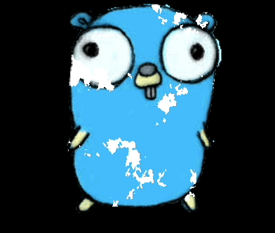

# Dissolve Shader Three.js

A small showcase of a dissolve shader. Inspired by the Shader chapter in [Bruno Simon's](https://twitter.com/bruno_simon) excellent course on ThreeJS.  Written with [React-Three-Fiber](https://github.com/pmndrs/react-three-fiber).



## Live Demo

Head over to https://demo-r3f-dissolve-shader.vercel.app/ to see the project live.

## Running locally

First, install the dependencies:

```bash
npm i
```

Then, run the development server:

```bash
npm run dev
```

Open [http://localhost:5173](http://localhost:5173) with your browser to see the result.
